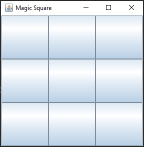
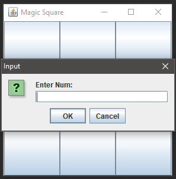

# Magic-square
The goal of this project was to develop a software version of the Magic-square game. This is currently a GUI-based playable version of the game, i.e., the game is played via the GUI using the mouse, with a GUI-based view of the board after each move. 

## Usage
These instructions will get you a copy of the project running on your local machine for development and testing purposes.

## What is Magic-square?
A magic square is a puzzle which consists in arranging numbers 1 to n^2 (where n >= 3) in
an n x n square such that all rows, columns and both diagonals sum to the same number.

### Getting started
To get the game started, run the MagicSquareController class as a Java Application. Or, run the Magic-square.jar file. You will be greeted with an empty grid.



### Interacting with the game

User input is processed via mouse. To place your number, simply click on an empty grid square. A message box will pop-up asking the user to input a number. The user types their number in the textfield and selects "ok" to place it. The user can also place a new number in place of another on the grid.



### Class description

```
- MagicSquareView: Creates the GUI components and acts as the view for the game
- MagicSquareController: Contains all the user interaction code through mouse presses
- MagicSquareEvent: The abstract class for game events that extends EventObject
- MagicSquareModel: The game model that creates a grid and makes moves
- MagicSquareListener: Interface implemented by MagicSquareModel for handling piece placement
- GameStatus: The enum for the current status of the game
```

## Built With

* [Eclipse](https://www.eclipse.org/downloads/) - The integrated development environment used
* [JUnit](https://junit.org/junit5/) - Testing Framework
* [Git](https://git-scm.com/) - Used for version control
